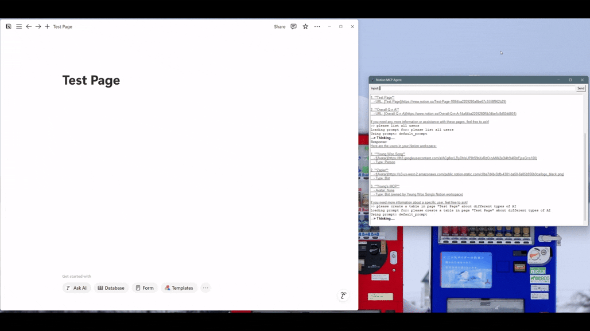

# Notion-MCP-Agent

#### Code

* **Server:** [`notion_mcp_server.py`](notion_mcp_server.py)
* **LangChain agent + Tkinter GUI:** [`notion_agent.py`](notion_agent.py)

---

## Overview

**Notion-MCP-Agent** is a personal project that turns your Notion workspace into a live, AI-driven knowledge hub.  
It pairs a **FastMCP** server that exposes tools for connected Notion pages with a **Tkinter-based GUI** built on **LangChain** and **GPT-4o** (or any compatible LLM). Together, they enable real-time page reading, writing, summarisation, and structured-note generation through a chat-style interface.

---

## Sample Demo
  
  

---

## Project Workflow

### 1 · FastMCP Server

| Step                  | Action                                                                                                                  |
| --------------------- | ----------------------------------------------------------------------------------------------------------------------- |
| **Tool Registration** | Defines tools such as `append_content`, `create_table`, `get_page_text`, and helpers for pages, blocks, and users.      |
| **Prompt Endpoints**  | Ships `default_prompt` for everyday tasks and `structured_notes_prompt` for long-form, deeply structured notes.         |
| **Transport**         | Runs over **SSE** (`/sse`) for lightweight, push-style communication.                                                   |

### 2 · LangChain Agent

| Step             | Action                                                                                           |
| ---------------- | ------------------------------------------------------------------------------------------------- |
| **Tool Loading** | Dynamically loads all exposed MCP tools into LangChain.                                           |
| **LLM**          | Defaults to `gpt-4o` via `ChatOpenAI`, but you can swap in any Ollama / OpenAI-compatible model.   |
| **Extra Tool**   | Adds an async `summarize` function to condense large Notion pages when extracting text summaries. |

### 3 · Tkinter GUI

1. **User Input** → sends prompt to the agent  
2. **Agent reasons** → decides which MCP tools to call  
3. **Tools Execute** → server hits Notion API, returns data  
4. **Agent Responds** → streamed answer displayed with styled text  
5. **Result** → summaries or page changes appear instantly in Notion  

---

## Tools & Libraries

| Purpose               | Library / Tech                 |
| --------------------- | ------------------------------ |
| Protocol & Server     | **FastMCP**, **MCP-Python**    |
| Notion SDK            | `notion_client`                |
| LLM Orchestration     | **LangChain**, **LangGraph**   |
| Large Language Model  | `gpt-4o` (swap-in Ollama LLMs) |
| GUI                   | **Tkinter**                    |
| Async / Transport     | `asyncio` runtime / **SSE**    |

---

## Key Features

* 🔧 **Rich Notion Toolset** – append markdown, build tables, create sub-pages, update titles, retrieve users, and more.  
* 💡 **Structured-Notes Mode** – one-command generation of 10-section study guides or tutorials.  
* ⚡ **Real-Time Interaction** – SSE keeps server and agent in sync with minimal latency.  
* 🖥️ **Standalone Desktop App** – run entirely locally via Tkinter; no extra web server required.  
* 🔒 **Data Privacy** – all operations remain within your connected Notion pages; optional local LLM.  
* 🛠️ **Extensible** – drop in new MCP tools or swap front-end frameworks without touching core logic.  
