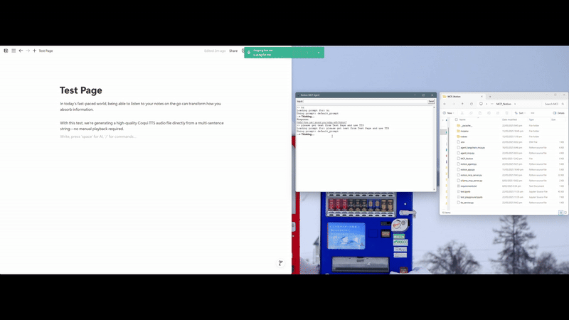

# Notion‑MCP‑Agent

#### Code

* **Server:** [`notion_mcp_server.py`](notion_mcp_server.py)
* **LangChain agent + Tkinter GUI:** [`notion_agent.py`](notion_agent.py)
* **TTS Service:** [`tts_service.py`](tts_service.py)
* **Environment:** `.env` (requires `NOTION_TOKEN`, optional `PAGE_ID` for testing)

---

## Overview

**Notion‑MCP‑Agent** turns your Notion workspace into a live, AI‑driven knowledge hub — *now with one‑click text‑to‑speech*.
A **FastMCP** server exposes a rich toolbox for manipulating Notion pages.Using **LangChain** Agentic Framework and **GPT‑4o** orchestrates conversations, read, write, summarise, build tables, manage metadata, and even generate MP3s of your notes — all in real time.

---

## Sample Demo

---

## Project Workflow

### 1 · FastMCP Server

| Step                  | Action                                                                                                                                                                                                                                                                                                            |
| --------------------- | ----------------------------------------------------------------------------------------------------------------------------------------------------------------------------------------------------------------------------------------------------------------------------------------------------------------- |
| **Tool Registration** | Registers **content tools** (`append_content`, `create_table`), **page tools** (`get_page_text`, `update_page_title`, `create_subpage`, etc.), **user tools** (`list_users`, `retrieve_user`, `get_me`), **search tools** (`search_notion`, `retrieve_page_property`), and **media tools** (`text_to_speech`). |
| **Prompt Endpoints**  | `default_prompt` for everyday tasks and `structured_notes_prompt` for 10‑section study guides (chain‑of‑thought).                                                                                                                                                                                                 |
| **Transport**         | Runs over **SSE** (`/sse`) for low‑latency, push‑style communication.                                                                                                                                                                                                                                             |

### 2 · LangChain Agent

| Step             | Action                                                                                             |
| ---------------- | -------------------------------------------------------------------------------------------------- |
| **Tool Loading** | Discovers and injects every MCP tool into LangChain at runtime.                                    |
| **LLM**          | Defaults to `gpt‑4o` via `ChatOpenAI`; swap in any Ollama / OpenAI‑compatible model with one flag. |
| **Helpers**      | Adds `summarize` (text) and `speak` (MP3) wrappers for large pages.                                |

### 3 · Tkinter GUI

1. **User types** a question or command.
2. **Agent plans** which tools to invoke (chain‑of‑thought shown in dev mode).
3. **FastMCP** hits the Notion API and/or Coqui TTS.
4. **Agent streams** the answer (plus an MP3 link when TTS is used).
5. **Result** instantly appears in your Notion workspace and desktop chat window.

---

## Available MCP Tools

| Category   | Tool                                    | Purpose (Args → Returns)           |
| ---------- | --------------------------------------- | ---------------------------------- |
| Content    | `append_content`                        | Markdown‑like → blocks (append)    |
|            | `create_table`                          | 2‑D list → Notion table block      |
| Read       | `get_page_text`                         | Deep text extraction (recursive)   |
| Properties | `retrieve_page_property`                | Paginated property read            |
| Pages      | `update_page_title`                     | Rename a page                      |
|            | `create_subpage`                        | Create child page                  |
|            | `retrieve_page`, `update_page`          | CRUD helpers                       |
| Users      | `list_users`, `retrieve_user`, `get_me` | Workspace user management          |
| Search     | `search_notion`                         | Full‑workspace search              |
| Media      | `text_to_speech`                        | Plain text → MP3 via **Coqui TTS** |

> 🛈 **Tip:** All tools raise `McpError` with a helpful message on failure — perfect for debugging in the GUI console.

---

## Tools & Libraries

| Purpose              | Library / Tech               |
| -------------------- | ---------------------------- |
| Protocol & Server    | **FastMCP**, **MCP‑Python**  |
| Notion SDK           | `notion_client`              |
| LLM Orchestration    | **LangChain**, **LangGraph** |
| Large Language Model | `gpt‑4o` (or any Ollama LLM) |
| Text‑to‑Speech       | **Coqui TTS**                |
| GUI                  | **Tkinter**                  |
| Async / Transport    | `asyncio` runtime / **SSE**  |

---

## Key Features

* 🔧 **End‑to‑End Workspace Control** – append blocks, build tables, rename pages, manage users, and search — all from chat.
* 🗣️ **Text‑to‑Speech** – highlight or request any content and receive a downloadable MP3.
* 💡 **Structured‑Notes Mode** – generate pedagogical 10‑section guides with intros, code, visuals, and references.
* ⚡ **Real‑Time Interaction** – SSE keeps server and agent perfectly in sync.
* 🖥️ **Local‑First Desktop App** – works offline with local LLMs and Coqui TTS; zero cloud cost if you choose.
* 🛠️ **Extensible** – add new MCP tools or swap frontend frameworks without touching core logic.
